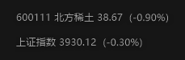
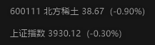

<div align="center">

# PeekStock

**低调的桌面行情便签 · 为上班摸鱼而生**

*瞄一眼行情，同事以为那是水印。*



</div>

---

PeekStock 是一个原生 Win32 编写的**桌面悬浮行情小工具**：置顶、无边框、半透明，
平时收缩成一行不起眼的灰色小字贴在屏幕角落，鼠标移上去才展开完整看盘面板。

没有框架、没有浏览器内核、没有第三方依赖 —— 一个 **1.6MB 的 exe**，拷走就能用，
常驻内存约 20MB，CPU 占用约 0%。

## 特性

- **极简隐形** — 精简模式为灰调单色水印风（雅黑 9pt），只用 ± 号区分涨跌，不细看注意不到
- **悬浮置顶** — 无边框半透明圆角窗，可拖动；鼠标移出自动收缩，移入展开完整面板
- **实时行情** — 每 5 秒单次批量拉取自选股 + 上证指数，红涨绿跌白平（展开模式柔和配色）
- **成本盈亏** — 设置成本价后行内显示 `(持±x.xx%)`，留空确认即可清除
- **快捷添加** — 输入 6 位代码自动识别沪深，或输入中文名在线反查（后台查询不卡界面）
- **涨跌排序** — 一键按涨跌幅升/降序排列
- **老板键** — `Ctrl+Q` 全局热键随时隐藏/唤出（隐藏期间停止一切网络请求）
- **省心省流** — 请求限频（最快 5 秒一次、防重入）、断网时指数显示 `--`、配置原子写入
- **绿色单文件** — 静态链接，无运行时依赖；配置放 `%APPDATA%\PeekStock\conf.json`

## 截图

**展开模式**（鼠标悬停时，完整看盘面板）



**精简模式**（平时贴在屏幕角落的样子，就是上面头图那张）

## 下载 / 构建

从 [Releases](../../releases) 下载 `PeekStock.exe` 直接运行，无需安装。

自行构建（需要 MinGW-w64，或 MSYS2 `pacman -S mingw-w64-ucrt-x86_64-gcc`）：

```
build.bat
```

或手动：

```
g++ -O2 -std=c++17 -static -static-libgcc -static-libstdc++ -municode -mwindows main.cpp -lgdiplus -lwinhttp -limm32 -lshell32 -lole32 -luuid -lgdi32 -o PeekStock.exe
```

全部源码在一个 `main.cpp`（约 1600 行），Win32 + GDI+，适合作为 Win32 分层窗口/自绘控件的学习参考。

## 使用

| 操作 | 说明 |
|------|------|
| 添加股票 | 输入框输入 6 位代码（6 开头→沪，其余→深）回车；或输入中文名自动反查 |
| 成本价 | 点行内「成本」，输入价格；**留空确认 = 清除**，Esc 取消 |
| 排序 | 点「排序↓/↑」按当日涨跌幅排序 |
| 固定 | 点「固定」后鼠标移开不再收缩（变彩色高亮前先看两眼就靠它） |
| 删除 | 点行内「删除」 |
| 隐藏/唤出 | `Ctrl+Q`（全局热键，任意界面生效） |
| 移动窗口 | 按住空白处拖动 |

配置文件在 `%APPDATA%\PeekStock\conf.json`（自选股与成本），换机器时拷贝它即可带走全部数据。

## 数据来源与免责声明

行情数据来自腾讯（`qt.gtimg.cn`）、股票名称反查来自新浪（`suggest3.sinajs.cn`）的公开接口，
均为 HTTP 明文请求、仅供个人学习与参考，**不构成任何投资建议**，接口变更可能导致功能失效。
请在遵守当地法律法规及你所在单位规定的前提下使用。

## License

[MIT](LICENSE)
